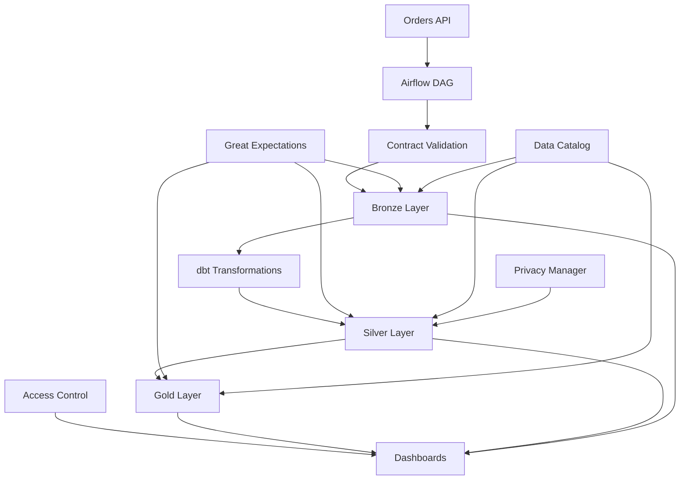

# iFood Data Governance Pipeline - Arquitetura

## Visão Geral da Arquitetura

O sistema de governança de dados do iFood foi projetado seguindo princípios de arquitetura moderna, escalabilidade e conformidade regulatória. A solução implementa uma arquitetura em camadas (Medallion) com governança integrada em cada etapa do pipeline.

## Componentes Principais

### 1. Data Contracts (`contracts/`)
- **Propósito**: Definir contratos de dados formais entre produtores e consumidores
- **Tecnologias**: YAML, Pydantic, JSON Schema
- **Funcionalidades**:
  - Validação automática de schema
  - Versionamento de contratos
  - Documentação automática
  - Testes de compatibilidade

### 2. Pipeline de Ingestão (`dags/`)
- **Propósito**: Orquestração e execução de pipelines de dados
- **Tecnologias**: Apache Airflow, Python
- **Funcionalidades**:
  - Ingestão de dados da API de pedidos
  - Validação de contratos em tempo real
  - Rastreabilidade completa (lineage)
  - Recuperação automática de falhas

### 3. Transformações dbt (`dbt/`)
- **Propósito**: Transformações SQL modulares e testáveis
- **Tecnologias**: dbt, SQL, Jinja2
- **Arquitetura Medallion**:
  - **Bronze**: Dados brutos com mínimas transformações
  - **Silver**: Dados limpos, padronizados e com PII mascarado
  - **Gold**: Dados agregados prontos para consumo

### 4. Qualidade de Dados (`data_quality/`)
- **Propósito**: Monitoramento e validação contínua da qualidade
- **Tecnologias**: Great Expectations, Python
- **Dimensões de Qualidade**:
  - Completude, Validade, Consistência
  - Pontualidade, Precisão, Unicidade

### 5. Catálogo de Dados (`catalog/`)
- **Propósito**: Descoberta, documentação e linhagem de dados
- **Tecnologias**: Python, JSON, Metadata APIs
- **Funcionalidades**:
  - Catalogação automática de datasets
  - Rastreamento de linhagem
  - Busca e descoberta
  - Metadados enriquecidos

### 6. Segurança e Privacidade (`security/`)
- **Propósito**: Proteção de dados e conformidade LGPD
- **Tecnologias**: Python, Cryptography
- **Funcionalidades**:
  - Mascaramento automático de PII
  - Controle de acesso baseado em roles (RBAC)
  - Processamento de solicitações LGPD
  - Auditoria de acessos

### 7. Dashboards (`dashboards/`)
- **Propósito**: Observabilidade e monitoramento visual
- **Tecnologias**: Streamlit, Plotly, Pandas
- **Dashboards**:
  - Visão geral de governança
  - Qualidade de dados detalhada
  - Linhagem e catálogo
  - Conformidade e segurança

## Fluxo de Dados



## Padrões Arquiteturais

### 1. Medallion Architecture
- **Bronze**: Dados brutos preservados para auditoria
- **Silver**: Dados limpos e padronizados para análise
- **Gold**: Dados agregados para consumo de negócio

### 2. Event-Driven Architecture
- Eventos de qualidade disparam alertas
- Mudanças de schema acionam validações
- Atualizações de catálogo são propagadas

### 3. Microservices Pattern
- Componentes independentes e especializados
- APIs bem definidas entre serviços
- Escalabilidade horizontal

### 4. Data Mesh Principles
- Domínios de dados bem definidos
- Produtos de dados como primeira classe
- Governança federada

## Segurança e Conformidade

### Controle de Acesso
```
Roles Hierárquicos:
├── Admin (acesso total)
├── Data Engineer (acesso técnico completo)
├── Data Analyst (leitura + análise)
├── Business User (leitura limitada)
├── Auditor (leitura + auditoria)
└── DPO (privacidade + conformidade)
```

### Proteção de PII
- Mascaramento automático em Silver
- Tokenização para analytics
- Anonimização para ML
- Retenção baseada em políticas

### Conformidade LGPD
- Identificação automática de PII
- Processamento de direitos do titular
- Auditoria completa de acessos
- Relatórios de conformidade

## Monitoramento e Observabilidade

### Métricas de Qualidade
- Score geral por dataset
- Tendências por dimensão
- Alertas automáticos
- SLAs de qualidade

### Métricas de Performance
- Latência de pipelines
- Taxa de sucesso
- Volume de dados processados
- Utilização de recursos

### Métricas de Governança
- Cobertura do catálogo
- Conformidade de contratos
- Aderência a políticas
- Satisfação dos usuários

## Escalabilidade

### Horizontal Scaling
- Airflow workers distribuídos
- dbt execução paralela
- Validações assíncronas
- Dashboards stateless

### Vertical Scaling
- Otimização de queries
- Cache inteligente
- Compressão de dados
- Índices estratégicos

### Cloud Native
- Containerização com Docker
- Orquestração com Kubernetes
- Storage elástico (S3/GCS)
- Compute on-demand

## Tecnologias e Ferramentas

### Core Stack
- **Orquestração**: Apache Airflow
- **Transformação**: dbt Core
- **Qualidade**: Great Expectations
- **Visualização**: Streamlit + Plotly
- **Linguagem**: Python 3.8+

### Storage & Compute
- **Data Lake**: Google Cloud Storage / AWS S3
- **Data Warehouse**: BigQuery / Snowflake
- **Cache**: Redis
- **Database**: PostgreSQL

### DevOps & Monitoring
- **CI/CD**: GitHub Actions
- **Containerização**: Docker
- **Monitoramento**: Prometheus + Grafana
- **Logs**: ELK Stack

## Padrões de Desenvolvimento

### Code Organization
```
ifood_data_governance_pipeline/
├── config/          # Configurações
├── contracts/       # Data contracts
├── dags/           # Airflow DAGs
├── dbt/            # Transformações SQL
├── data_quality/   # Validações de qualidade
├── catalog/        # Catálogo de dados
├── security/       # Segurança e privacidade
├── dashboards/     # Interfaces visuais
├── utils/          # Utilitários comuns
├── tests/          # Testes automatizados
└── docs/           # Documentação
```

### Naming Conventions
- **Datasets**: `{layer}_{domain}_{entity}`
- **Pipelines**: `{domain}_{process}_dag`
- **Tests**: `test_{component}_{functionality}`
- **Configs**: `{environment}.{format}`

### Quality Gates
- Testes unitários obrigatórios
- Validação de contratos
- Code review obrigatório
- Deploy automatizado

## Roadmap Técnico

### Fase 1 (Atual)
- ✅ Arquitetura base implementada
- ✅ Pipeline de pedidos funcional
- ✅ Dashboards básicos
- ✅ Conformidade LGPD

### Fase 2 (Próximos 3 meses)
- ✅ Integração com mais domínios
- ✅ ML para detecção de anomalias
- ✅ APIs REST completas
- ✅ Alertas inteligentes

### Fase 3 (6 meses)
- ✅ Data Mesh completo
- ✅ Self-service analytics
- ✅ Governança automatizada
- ✅ Compliance multi-região

## Contatos e Suporte

- **Arquiteto de Dados**: data-architecture@ifood.com
- **Engenharia de Dados**: data-engineering@ifood.com
- **Governança**: data-governance@ifood.com
- **Suporte**: data-support@ifood.com
